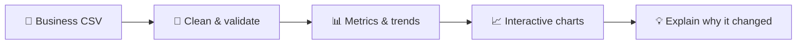
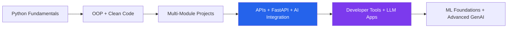

  

  

  
  
  
  

---

## About Me

I'm **Bilal Aslam**, a Computer Science student learning by building increasingly ambitious projects.

My work has moved beyond beginner exercises into **multi-module Python systems, AI-powered applications, structured debugging tools, business-intelligence tooling, APIs, desktop interfaces, and real project architecture**.

- 🔭 **Currently building:** [VISORA BI](https://github.com/bilal-dev-0x/Visora-BI) and AI-assisted developer tools
- 🐍 **Main language:** Python
- 🧠 **Exploring:** LLM APIs, data analysis & visualization, debugging workflows, backend architecture, and GenAI applications
- 🛠️ **Learning by doing:** build → break → debug → improve → ship
- 🎯 **Goal:** Become a strong Python/AI developer who can turn ideas into working products

> My portfolio is basically a laboratory where innocent Python code is released into the wild and observed under extreme debugging conditions. 🧪🐍

---

## Current Tech Toolbox

  

---

## 🚀 Featured Projects

### 📊 [VISORA BI](https://github.com/bilal-dev-0x/Visora-BI)

**Make the hidden obvious.** A business intelligence tool that turns messy business data into clear, evidence-backed decisions.

Upload a business CSV, and VISORA BI understands and cleans the data, then surfaces the trends, unusual changes, and insights that actually deserve attention.

**Highlights**
- Transparent data-quality handling instead of silent fixes
- Meaningful business metrics, trends, and unusual-change detection
- Interactive visualizations
- "Numbers first" design with separate backend, API, and frontend layers

**Stack:** Python · Pandas · Plotly · Streamlit · FastAPI · Flask
**Status:** 🛠️ Active development

---

### 🟣 [RAZE Debug Mentor](https://github.com/bilal-dev-0x/RAZE-Debug-Mentor)

**Evidence-driven debugging mentor for Python-first development.**

RAZE executes submitted code, captures runtime evidence, guides the user through **two focused diagnostic questions**, and then produces a structured root-cause explanation with corrected code.

**Highlights**
- Real Python execution evidence and traceback capture
- FastAPI backend with session isolation
- Multi-provider AI failover: Gemini → OpenRouter → Groq
- Deterministic local fallback when AI providers are unavailable
- Structured debugging workflow instead of generic chatbot answers
- Regression tests for debugging patterns and API behavior

**Stack:** Python · FastAPI · Jinja2 · Vanilla JavaScript · Gemini · OpenRouter · Groq

---

### 🧠 [MindReader AI](https://github.com/bilal-dev-0x/MindReader-AI)

**AI-powered personality scanner with a modern desktop GUI and CLI.**

Users answer behavioral scenarios and Gemini generates a playful personality breakdown with trait scores, observations, and roast-heavy results.

**Highlights**
- Google Gemini integration
- CustomTkinter desktop GUI
- Rich-powered terminal interface
- Modular OOP architecture
- Background AI calls to keep the GUI responsive
- Automatic timestamped report saving

**Stack:** Python · Gemini API · CustomTkinter · Rich · OOP

---

### 💳 [CrediSys — Loan Management System](https://github.com/bilal-dev-0x/CrediSys-Loan-Management-System)

**A terminal-based business management system built from scratch in Python.**

CrediSys manages customers, loan plans, reducing-balance repayment schedules, payments, overdue tracking, analytics, logging, and AI-assisted features.

**Highlights**
- Multi-module Python architecture
- Real reducing-balance EMI calculations
- Customer and loan validation
- Payment and overdue tracking
- JSON-based persistence
- Business analytics and growth snapshots
- Gemini-powered internal assistant

**Stack:** Python · JSON · Gemini API · python-dotenv · python-dateutil

---

### 📌 Repo Cards

  
  

  
  

---

## Other Projects

| Project | What I Built |
|---|---|
| [KOVA AI Virtual Assistant](https://github.com/bilal-dev-0x/KOVA-AI-Virtual-Assistant) | Python voice/AI assistant, my testbed for moving from a single script to proper OOP architecture |
| [Random Fake Headline Generator](https://github.com/bilal-dev-0x/Random-Fake-Headline-Generator) | Text generation and Python logic practice |
| [Number Guessing Game](https://github.com/bilal-dev-0x/Number-guessing-game) | Core programming logic, loops, conditions, and user interaction |
| [Snake Water Gun Game](https://github.com/bilal-dev-0x/Snake-water-gun-Game) | Randomization, decisions, and game logic |

---

## 📈 Current Learning Direction

### Right now, I'm focusing on

- Building production-style Python projects
- Turning raw data into insights, metrics, and visualizations
- Debugging and understanding real code failures
- Backend architecture and APIs
- LLM integrations and AI provider failover
- Writing cleaner, more maintainable code
- Moving from "I made a project" to "I engineered a system"

---

## GitHub Dashboard

  
  

  

  

---

## Current Status

**Status:** Building 🚀  
**Primary Weapon:** Python 🐍  
**Current Boss Fight:** VISORA BI + better architecture 👾  
**Special Ability:** Turning bugs into portfolio features

  <b>Build. Break. Debug. Understand. Improve. Ship. Repeat.</b>

## 🤝 Let's Connect

  
  

  

